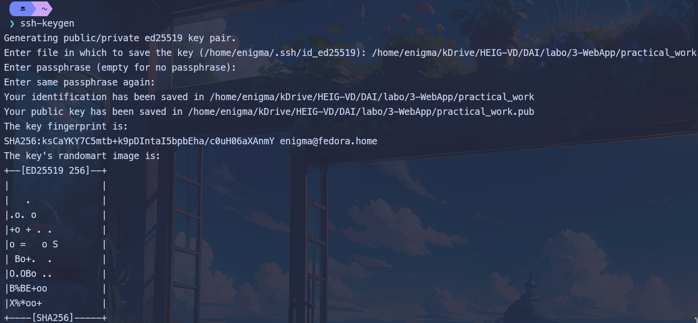
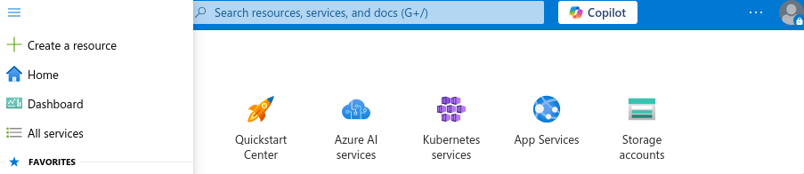
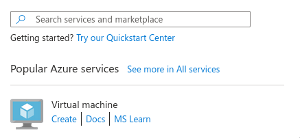
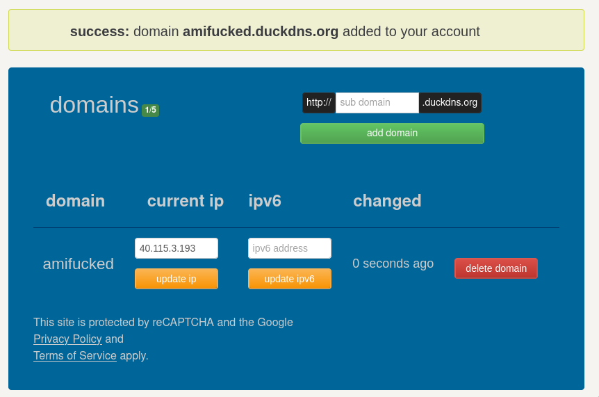

# Users API

The users API allows to manage users. It uses the HTTP protocol and the JSON format.

The API is based on the CRUD pattern. It has the following operations:

- Create a new user
- Update a user
- Delete a user

## Endpoints

### Create a new user

- `POST /users/`

Create a new user.

#### Request

The request body must contain a JSON object with the following properties:

- `firstName` - The first name of the user
- `lastName` - The last name of the user
- `username` - Username chosen by user (must be unique)
- `password` - Password of the account

#### Response

The response body contains a JSON object with the following properties:

- `id` - The unique identifier of the user
- `firstName` - The first name of the user
- `lastName` - The last name of the user
- `username` - Username chosen by user
- `password` - Password chosen by user

#### Status codes

- `201` (Created) - The user has been successfully created
- `400` (Bad Request) - The request body is invalid
- `409` (Conflict) - Username already exists

### Modify an existing user

- `POST /users/{id}`

Update user infos

#### Request

The request contains a JSON object with the following possible properties (depending on what he wants to update) :
- firstName
- lastName
- username
- password

#### Response

The response contains a JSON with the following properties :
- `id` - The unique identifier of the user
- `firstName` - The first name of the user
- `lastName` - The last name of the user
- `username` - Username chosen by user
- `password` - Password chosen by user

#### Status codes

- `201` (Created) - The user informations were correctly updated
- `400` (Bad Request) - The request body is invalid

### Delete an existing user

- `DELETE /users/{id}`

Delete user

#### Request

The request has an empty body, only giving id in url

#### Response

The response has also an empty body

#### Status codes

- `204` (No content) - Delete was successful, no content is present in the body
- `404` (Not Found) - The specified user does not exist


# Subject API

The subject API allows to manage subjects. It uses the HTTP protocol and the JSON format.

The API is based on the CRUD pattern. It has the following operations:

- Create a new subject
- Update a subject
- Delete a subject


## Endpoints

### Create a new subject

- `POST /subjects/`

Create a new subject.

#### Request

The request body must contain a JSON object with the following properties:

- `shortName` - The short form of the subject's name
- `fullName` - The full name of the subject

#### Response

The response body contains a JSON object with the following properties:

- `id` - The unique identifier of the subject
- `shortName` - The short form of the subject's name
- `fullName` - The full name of the subject

The `Last-Modified` header is updated with a new timestamp

#### Status codes

- `201` (Created) - The subject has been successfully created
- `400` (Bad Request) - The request body is invalid
- `409` (Conflict) - Subject already exists

### Modify an existing user

- `POST /subjects/{id}`

Update subject infos

#### Request

The request contains a JSON object with the following possible properties (depending on what he wants to update) :

- `shortName` - The short form of the subject's name
- `fullName` - The full name of the subject


#### Response

The response contains a JSON with the following properties :
- `id` - The unique identifier of the subject
- `shortName` - The short form of the subject's name
- `fullName` - The full name of the subject

The `Last-Modified` header is updated with a new timestamp

#### Status codes

- `201` (Created) - The subject's informations were correctly updated
- `404` (Not Found) - The subject was not found
- `412` (Precondition Failed) - Ressource was modified in the meantime

### Delete an existing subject

- `DELETE /subjects/{id}`

Delete subject

#### Request

The request has an empty body, only giving id in url

#### Response

The response has also an empty body

#### Status codes

- `204` (No content) - Delete was successful, no content is present in the body
- `404` (Not Found) - The specified user does not exist

# Enrollment API

The enrollments API allows to manage enrollments (link between a user and a subject, containing their respective grades). It uses the HTTP protocol and the JSON format.

The API is based on the CRUD pattern. It has the following operations:

- Create a new enrollment
- Add a grade to an enrollment
- Delete an enrollment
- Get an overview of all enrollments for a user

## Endpoints

### Create a new enrollment

- `POST /enrollment/users/{userId}/subjects/{subjectId}`

Create a new enrollment.

#### Request

Body is empty, only userId and subjectId are specified in url

#### Response

The response body contains a JSON object with the following properties:

- `userId` - The unique identifier of the user
- `subjectId` - The unique identifier of the subject
- `courseGrades` - List of course grades
- `labGrades` - List of lab grades

In addition the `Last-Modified` header is updated with a new timestamp

#### Status codes

- `201` (Created) - The user has been successfully created
- `404` (Not Found) - Subject or User not found
- `409` (Conflict) - Username already exists

### Add a grade to an enrollment

- `POST /enrollment/users/{userId}/subjects/{subjectId}/addGrade`

Add grade (lab or course) to an existing enrollment

#### Request

The request contains a JSON object with either one the following property: 
- labGrade - Grade given for a lab
- courseGrade - Grade given for a midterm

#### Response

The response's body is empty

The header `Last-Modified` is updated with a new timestamp

#### Status codes

- `200` (OK) - The user informations were correctly updated
- `400` (Bad Request) - The request body is invalid
- `404` (Not Found) - Enrollment does not exist with this keys association

### Delete an existing enrollment

- `DELETE /enrollment/users/{userId}/subjects/{subjectId}`

Delete enrollment

#### Request

The request has an empty body, only giving IDs in url

#### Response

The response has also an empty body, but `Last-Modified` header is updated with a new timestamp

#### Status codes

- `204` (No content) - Delete was successful, no content is present in the body
- `404` (Not Found) - The specified user does not exist
- `412` (Precondition Failed) - Ressource was updated in the meantime

### Get an overview of all enrollments for a user

- `GET /enrollment/users/{userId}/overview`

Get the overview of all the enrollments of the user, with their actual avg grades per subject and previsionnal average 

#### Request

Body is empty, only `userId` is taken from the url

#### Response

The response body contains a JSON object withe the following properties:

- `subject` - Subject name and other attributes
- `avgBeforeExam` - Average grade before taking the exam
- `prevAvg` - Expected average grade depending on the one that one could have in the exam


In addition the `Last-Modified` header is updated with a new timestamp

#### Status codes

- `200` (OK) - The request has been served
- `404` (Not Found) - No user was found with this ID
- `412` (Precondition Failed) - Ressource was changed in the meantime

# Authentication API

The Authentication API manages the login, logout, adn roles validation.

## Endpoints

### Login

- `POST /auth/login`

Authenticate a user and create cookies with its userId and for its role.

#### Request

The request body must contain a JSON object with the following properties:

- `email` - The user's email address (required).
- `password` - The user's password (required).

#### Response

Creation of those cookies if successful

- `user` - The ID of the authenticated user.
- `role` - The user's role (e.g., `LOGGED_IN`).

The body of the response is empty

#### Status codes

- `204` (No Content) - Login successful.
- `400` (Bad Request) - The request body is invalid.
- `401` (Unauthorized) - Invalid email or password.

---

### Logout

- `POST /auth/logout`

Remove their cookies for logout a user

#### Request

No body needed for the request

#### Response

The response body is empty.

#### Status codes

- `204` (No Content) - Logout successful.

---

## Authorization Middleware

The `AuthRoleController` class is responsible for checking user roles for each endpoints


#### Usage

```java
AuthRoleController.checkRole(Context requestContent, Set<Role> permittedRoles);
```

- `requestContent` - The HTTP context of the request.
  - `permittedRoles` - Every possible roles

#### Behavior

- If the user's role (retrieved from the `role` cookie) matches one of the permitted roles, the action proceeds.
- If not, a `403 Forbidden` response is returned.

#### Status codes

- `403` (Forbidden) - Access is not authorized.

---

## Cookies

### User Cookie

- **Name:** `user`
- **Description:** Stores the ID of the authenticated user.
- **Lifetime:** Session duration.

### Role Cookie

- **Name:** `role`
- **Description:** Stores the role of the authenticated user (e.g., `LOGGED_IN`, `ADMIN`).
- **Lifetime:** Session duration.

# Setup Web Infrastructure

## Generate SSH Key

For authentication we will need a ssh key, so generate it now to use it later
- Generate ssh-key with 
```
ssh-keygen
```
<p align="center">
  
</p>

## Create virtual machine

- Create new ressource on azure
<p align="left">
  
</p>

- Select the `Virtual Machine` ressource

<p align="left">
  
</p>

- Setup ressource  

  - On azure, fill the form with these informations to create the VM:
    - Project details
        - **Subscription**: Azure for Students
        - **Resource group**: Create new with the name heig-vd-dai-course
    - Instance details
       - **Virtual machine name**: practical-work-3
       - **Region**: (Europe) West Europe
       - **Availability options**: No infrastructure redundancy required
       - **Security type**: Trusted launch virtual machines (the default)
       - **Image**: Ubuntu Server 24.04 LTS - x64 Gen2 (the default)
       - **VM architecture**: x64
       - **Size**: Standard_B1s - you might need to click "See all sizes" to see this option
    - Administrator account
        - **Authentication type**: SSH public key
        - **Username**: ubuntu
        - **SSH public key source**: Use existing public key
        - **SSH public key**: Paste public key previously generated here    
      - Inbound port rules
        - **Public inbound ports**: Allow selected ports
        - **Select inbound ports**: HTTP (80), HTTPS (443), SSH (22)

  Click on `Review + create`

  Wait for the VM to be ready

## Setup virtual machine

- Connect to the virtual machine with its public ip address :
```
ssh ubuntu@40.115.3.193
```

If the key was created in an other folder than .ssh, add -i parameter to the command to specify the path where your key is stored  
```
# In our case
ssh -i /home/enigma/kDrive/HEIG-VD/DAI/labo/3-WebApp/practical_work ubuntu@40.115.3.193
```

- Update packages on the VM and reboot to apply
```
sudo apt update
sudo apt upgrade
sudo reboot
```

## Acquire domain name

Go to duckdns.org and get a domain name

- Set the IP address of the A record (current IP field) with the public address of the server
<p align="left">
  
</p>

- Verify that resolution works
```
nslookup amifucked.duckdns.org
```

Should return something like this
```
Server: 127.0.0.53
Address: 127.0.0.53#53

Non-authoritative answer:
Name: amifucked.duckdns.org
Address: 40.115.3.193
```
